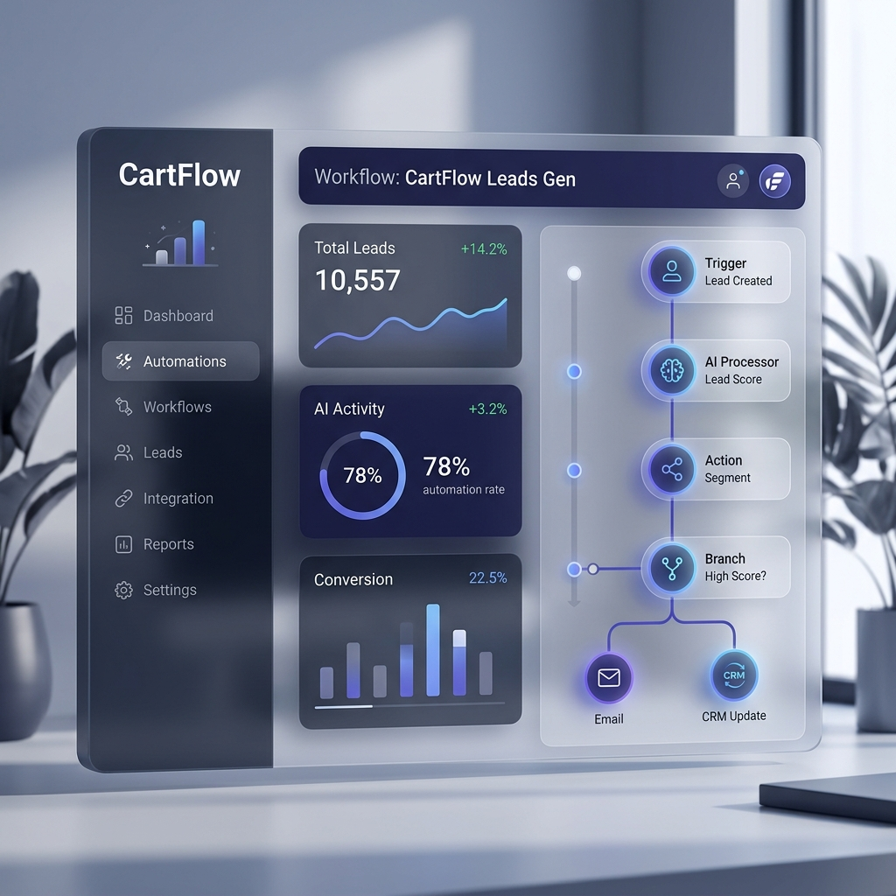
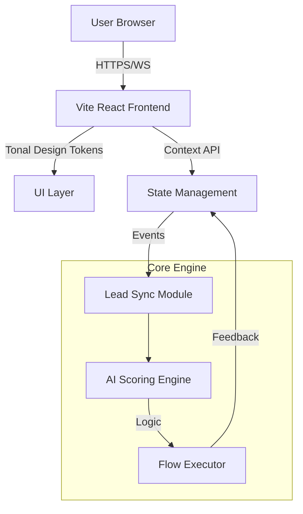
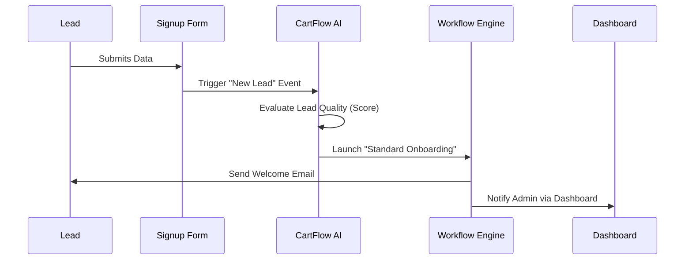

<div align="center">

# 🌊 CartFlow AI
### *The Ethereal Architect of Automation*



[](https://vitejs.dev/)
[](https://reactjs.org/)
[](https://developer.mozilla.org/en-US/docs/Web/JavaScript)
[](https://opensource.org/licenses/MIT)

**A high-fidelity, premium SaaS dashboard built with logic, light, and motion.**

[Explore Features](#-features) • [System Architecture](#-system-architecture) • [Design Philosophy](#-design-philosophy) • [Getting Started](#-getting-started)

</div>

---

## 🏗️ System Architecture

The CartFlow engine is built on a distributed, event-driven architecture designed for sub-100ms response times.



## 🔄 Lead Lifecycle Flow

How leads journey through the CartFlow automation pipeline:



## ✨ Overview

**CartFlow AI** is a state-of-the-art automation hub designed for those who value both performance and aesthetics. Born from the **"Ethereal Architect"** design system, it breaks the mold of traditional rigid dashboards, offering a limitless canvas where data flows naturally through light and shadow rather than borders and lines.

## 🎨 Design Philosophy: "The Ethereal Architect"

CartFlow is built on a "No-Line" rule. We prioritize **Tonal Layering** over structural containment.
- **Limitless Canvas:** Boundaries are defined solely through background shifts.
- **Glassmorphism:** High-priority overlays use `backdrop-filter: blur(12px)` for a sophisticated, semi-translucent feel.
- **Ambient Shadows:** Multi-layered shadows create a "natural lift" rather than artificial depth.
- **Editorial Typography:** A dual-font approach (Manrope for Headlines, Inter for UI) ensures clarity and authority.

## 🚀 Features

### 📊 Intelligent Dashboard
- **Real-time Metrics:** Monitor active leads, conversations, and automation health.
- **Engagement Analytics:** Visualized growth rates and high-density data summaries.
- **Activity Stream:** Last-second updates from your automation flows.

### ⚡ Visual Flow Builder
- **Node-based Automation:** Drag-and-drop logic (visualized via vertical stacking).
- **Conditional Logic:** Trigger actions like Lead Scoring or Welcome Sequences with sub-100ms latency.

### 💬 Unified Conversations
- **Omnichannel Support:** Manage messages from across your lead sources in one glassmorphic interface.
- **Instant Sync:** Collaborative threads with real-time status indicators.

### 👥 Leads & Billing
- **Lead Scoring:** AI-evaluated quality metrics.
- **Tiered Management:** Handle Pro-Tier billing and detailed invoice history with ease.

## 🛠️ Tech Stack

- **Core:** React 18 + Vite (for lightning-fast HMR)
- **Styling:** Vanilla CSS (Tailwind concepts applied via custom Tonal Tokens)
- **Icons:** [Lucide React](https://lucide.dev/)
- **Routing:** React Router DOM v6

## 🏁 Getting Started

### Prerequisites
- [Node.js](https://nodejs.org/) (v16.x or higher)
- [npm](https://www.npmjs.com/)

### Installation

1. **Clone the repository:**
   ```bash
   git clone https://github.com/Ayushpersonal/Saas_IG_App.git
   cd CartFlowDashboard
   ```

2. **Install dependencies:**
   ```bash
   npm install
   ```

3. **Launch the development server:**
   ```bash
   npm run dev
   ```

4. **Build for production:**
   ```bash
   npm run build
   ```

## 📄 License

This project is licensed under the MIT License - see the [LICENSE](LICENSE) file for details.

---

<div align="center">
Built with ❤️ by the CartFlow Team
</div>
